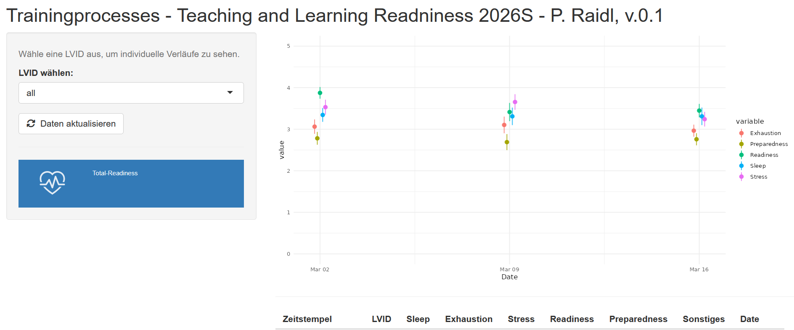
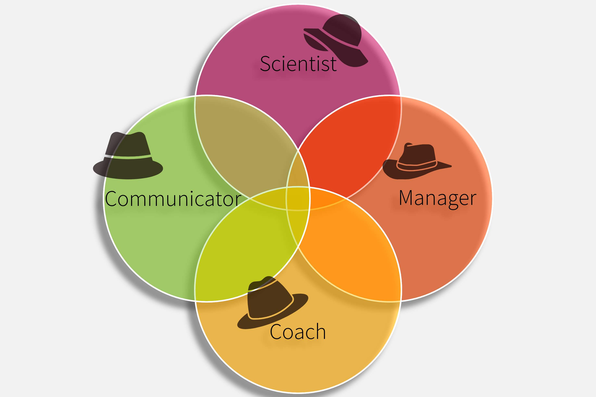

```{r}
library(tidyr)
library(dplyr)
library(readxl)
library(knitr)
library(kableExtra)
```

This chapter is relevant for students in my course. If you are not currently enrolled, you can skip this chapter and directly jump to the chapter on the training process [@sec-2-trainingprocess].

# Curriculum

As students attending this course, you already have a basic understanding of sports science, biomechanics, physiology, sports physiology, sports psychology, and related fields. The goal of this course is to translate the theoretical knowledge already acquired into practical applications. Following the curriculum, by the end of the course, you should be able to ...

1.  .... plan, conduct, evaluate, and reflect on training sessions as the smallest part of a training process.

2.  ... creating a training plan, structuring the load parameters goal-oriented, and managing and adjusting the training.

3.  ... guide and facilitate self- and external reflection in order to continuously improve the entire training work, its progress, and documentation.

# My Goals

As a teacher, I want to create an open space for discussions, allowing us to consider diverse opinions and approaches. Many of you already bring experience and expertise in a specific area of training and movement. You have experience as athletes, coaches, or in other roles within sports- and movement-related areas. This expertise has proven to be very helpful for fellow students in past semesters and creates opportunities for exchange and collaborative learning. I hope to create a diverse course for you to deepen your understanding of training, establish an area of experience and gain new practical insights. The content is based on my readings of current scientific discussions and is expanded and complemented by personal experiences and best-practice examples.

# Tracking Progress

An important part of a successful training process is continuous monitoring and adjustment of the training. Similarly, I try to control and evaluate the learning process. For this, I rely on a similar multi-stage control system with testing and monitoring.

(1) Informally, I rely on your feedback in addition to my own documentation and reflection.
(2) To assess knowledge transfer, I use **quizzes** both during and after the sessions.
(3) There are also so-called **check-out tasks** on the learning platform *Moodle*. These consist of short reflections. Unlike the quizzes, they rely less on pure knowledge (recall) and instead support understanding and analyzing the concepts. Additionally, the content is placed in the context of your own experience.
(4) An acute **monitoring system** (@fig-dashboard) is being introduced to track your self-assessment. This is created in line with typical monitoring tools, assessing readiness and fatigue before, during, and after a training session. The goal during training is to provide real-time adjustments to the load. Similarly, the monitoring will help me adjust my teaching to your needs as a student.
(5) A **teach-back** session also offers the opportunity for a control system: in this session, you take on the role of teacher and share your own skills and experiences with your colleagues.
(6) An **evaluation** is conducted each semester using the official evaluation form of the institute and the University of Vienna to allow for anonymous feedback from you.

[{#fig-dashboard fig-align="center"}](https://peterraidl.shinyapps.io/Monitoring_LVTP/)

## Your LVID

Every student receives a Unique Identifier (LVID) during the course, which is a random four-digit number. This should be used when conducting pseudonymized evaluations, filling out monitoring, and for some assignments. This strategy helps me to gain an unbiased view of the performance and your feedback.

# Organizational Directives

Several rules are proposed at the beginning of the course. These are to be reviewed by you and can be challenged until the third session. A change to the rule can be proposed in the plenary and voted on together. The current rule proposals are as follows:

## Open discussion

I want to establish an atmosphere for discussion where all opinions are welcome. This means that not only I, but also students who speak up, will be given attention, and the opinions and questions of everyone will be taken seriously. We will, however, strictly stick to discussions related to the immediate topic. The open discussion also includes the assessment criteria and partial performances. These can also be objected to until the third session.

## Attendance rate

The minimum attendance requirement is set at 75% of the sessions. A session is considered fully attended if the student is no more than 15 minutes late. If the 15-minute limit is exceeded, half of the attendance will be deducted. Repeated unjustified late arrivals of less than 15 minutes may result in a deduction of points from the participation grade. This is to ensure a smooth process. Being on time for the course not only supports you but also helps your colleagues engage with the content independently.

## Independent Performance

### Plagiarism

Independent performance is a key criterion of the course. Plagiarism is, therefore, strictly penalized. According to legal standards, plagiarism is the intentional adoption of content without citing the source ([see guidelines Univie, 2026](https://studienpraeses.univie.ac.at/en/information-on-study-law/safeguarding-good-scientific-practice/plagiarism/)). Since plagiarism can also occur unintentionally, the first submission of a plagiarized work results in a warning. However, continued violations will result in a reduction in points; partial performance will then be graded with as few as 0 points.

## Use of Artificial Intelligence

The regulation of **independent student performance** also extends to non-biological entities, especially large language models (LLMs[^2-intro-1]). Of course, the use of AI can be a great support in developing content or analyzing datasets. However, it also carries the risk of negatively affecting learning experience, creativity, and the ability to find one's own solutions.

[^2-intro-1]: I will mostly refere to AI

Strictly ensure that the data we are using is only fed in anonymized! Our course material is already a tweaked version of the original data. However, the moment you are working with real athletes [^2-intro-2] it is one of your highest priorities to securely handle their data! That is what we aim for during the course. In cases of obvious neglect and misuse of AI, there will be significant point deductions. A typical sign of AI misuse is citing hallucinated studies. Results from evaluations can also contain errors. If AI use is not disclosed fully, a deduction of up to 20 points will be applied. When non-anonymized data is given to the models, up to 40 points will be deducted, making it difficult to pass.

[^2-intro-2]: Throughout the text I will refere to athletes. However, all basic principles of the training process could be relevant for working with patients or the general population. Just think about it the way Bill Bowerman framed it: "if you have a body, you are an athlete." (I couldn't find the original source of this quote; however, Bowerman seems to be referenced most often)

> *The road to hell is paved with good AI models*

## How to use AI for this course

Realistically, I cannot control how much you use AI for course assignments. However, I would like to suggest a targeted use! **AI should support your thinking and learning rather than replace them.**

The foundation of AI-supported work is what I call the **1-2-3 Rule**: Give each task at least **1 hour** of your own unsupported thinking, spread out over at least **2 different days**. After that, it’s helpful to get feedback, and AI can provide valuable support. When doing so, use at least **3 chained prompts** for re-evaluating inputs and outputs.

::: callout-tip
## 1-2-3 rule of AI use for learning and thinking

One hour on two days with three prompts — this heuristic should guide you when using AI during learning.
:::

### Additional tips for using AI:

**Research:** When you are new to a topic, it can sometimes be difficult to find the right studies because you are not yet familiar with the technical terms. Of course, just reading a lot may help in the long run. However, AI can provide an overview of the most important terms and concepts to get started. AI can also improve search strings and help you become familiar with major databases like PubMed and Web of Science. AI can also help you find studies and summarize the content. But this is tricky! Currently, we lecturers see a lot of hallucinated information in submitted students' texts. If you use AI to find and comprehend information, always double-check the original source thoroughly! You will be surprised how often AI confidently gives you information that is actually false. The models will improve over time, and maybe in a few years, they will be better than any expert in providing information. But we are not there, yet - and it is not certain that we will get there!

**Devil’s Advocacy:** Most common standard AI models tend to agree with you even when you're wrong. They often reinforce our preconceptions. Additionally, we are inclined to believe them because of their eloquent wording, convincing tone, and (sometimes random or hallucinated) sources—especially when they reinforce our assumptions. <!--#(SOURCES: https://doi.org/10.1609/aaai.v39i22.34550 need more) -->. Instead, give the AI the task of criticizing your work and identifying weaknesses. It gives a pretty good sparring partner if it knows what you want from it. Explain something you may think you know, or prompt your ideas on a training process, and ask it to tell you where you are wrong or what concepts you missed. (Remember, you can also be your own devil's advocate before letting the AI do it #1-2-3rule.)

**Data management:** If you want to edit data or display it in a chart, AI naturally offers a way to support you. However, instead of directly entering the data and letting AI create the chart, it is advisable to request a code block in R or Python or a step-by-step guide for Excel. Let it explain each step so you understand the intention and the technicalities. This way, you don't have to reveal your data, and you also avoid the risk of the AI distorting the data points or calculating something incorrectly, even if it 'knows' the correct method.

**Language curation:** If you use AI to improve language, grammar, and spelling, it is always advisable to list the proposed changes. If you use Word (or a similar software), you can use *comparison mode* to see the curation side by side with the original version. This text is heavily curated with AI (u:AI and Grammarly). But I frequently encounter mistakes or misrepresentations of my entered text. So stay vigilant on that front too.

**Further Information:** You can also find some information on AI on the university's website ([Checklist Univie, 2026](https://studieren.univie.ac.at/en/using-ai-in-your-studies/academic-work-and-writing-with-ai/checklist-for-the-responsible-use-of-ai/))

## Arbeitsaufwand

The course is listed with 2 ECTS credits. This should correspond to a workload of 50-60 hours for the average student ([ECTS Univie, 2026](https://studieren.univie.ac.at/en/abc-of-terminology/related-entries/?tx_irfaq_pi1%5BshowUid%5D=30862&cHash=5a07e0ec2271e001eb09cf487f209db1)). The attendance time is approximately 22 hours, so you can expect an additional workload of 30 hours. Spread over the semester, this amounts to roughly 1 hour and 45 minutes per week. Since the assigned workload is based solely on my estimate, I ask that you track your actual effort. Complete tracking will be rewarded with extra points and will help improve the course's quality.

## Assessment Criteria and Grading

The grading follows the institute's usual standards (@tbl-grades). The partial performances consist of *main components* (monitoring, training documentation, journal club, teach-back, data processing) and *bonus components* (round table, workload tracking).

```{r}
#| label: tbl-grades
#| tbl-cap: "grading of the course"
grading_tbl <- readxl::read_xlsx("./files/organisation.xlsx",
                                 sheet = "grading")

knitr::kable(grading_tbl) %>% 
    kableExtra::kable_styling(bootstrap_options = c("striped", "hover"), position = "center", full_width = F, )

```

I strive for a fair assessment. Individual solutions for performance delivery are possible, but should be discussed with me early on. Please contact me as soon as possible if you need any adjustments.

**Participation** is primarily assessed through quizzes during class, as well as two quizzes to be completed at home. Additionally, the *check-outs* on Moodle are taken into account.

**Training Documentation:** You should keep your own training journal and monitor your training throughout the semester. Later in the semester, you will draw conclusions from it and create a training plan fitting your personal needs. The minimum requirement is a training diary covering at least 8 weeks, including all load parameters and using an additional monitoring tool (see later chapters). I think it is a good practice to document and evaluate one's own training process.

**Journal Club:** Two sessions will be dedicated to reading and interpreting training-related articles. Continuous education through understanding scientific evidence is essential. We must assume that learned knowledge quickly becomes outdated. Therefore, adapting your own actions based on new evidence is unavoidable for a professional sports scientist. I will provide you with an article in each session. After discussing some general reading strategies and how to organize acquired knowledge, you will read the articles by yourself, following the outlined structure. Afterwards, we will discuss the topic and try to identify actionable strategies from the information.

**Teach-Back:** In this session, you take on the role of the teacher and present a topic you have prepared. This provides an opportunity to incorporate your own areas of expertise. Each presentation should last about 10 minutes and will be held in front of an audience of 4-5 other students. The assessment is provided through peer review within your small group. This is really an opportunity to strengthen your own understanding of what you think matters most. You can also think of it *Richard-Feynman-Style who* has said on different occasions that *you only really understand it when you can explain it in simple terms.*

**Data Processing:** During the course, you will work with training and test data. Sometimes we do that in class, sometimes there is an at-home exercise. The goal is to act as a trainer and answer specific practical questions by analyzing the data. You will need a laptop or tablet for this. We use *Google Sheets* because it works well across systems, it's easy to distribute data, and it is free to use. If you have some experience with Excel, R, Python, or any other program/language, feel free to transition. Submissions are evaluated as reports or specific questions that will be given to you with the dataset.

**Bonus 1 - Roundtable:** A live in-person event featuring external experts from science and practice is held each semester. In the 2026S semester, we will focus on field sports in light of the upcoming FIFA World Cup. All students are invited to participate and will receive 10 extra credit points.

**Bonus 2 - Tracking Workload:** I created this bonus assignment to better understand how much work students need to put into the material to progress through the course. To get 5 extra points, submit a table listing all tasks you have performed for this seminar, including the times. It must be in a format I can easily edit and analyse (.csv, .txt, .xlsx).

```{r}
#| label: tbl-points
#| tbl-cap: "assignment points"
points_tbl <- readxl::read_xlsx("./files/organisation.xlsx",
                                 sheet = "points")

knitr::kable(points_tbl) %>% 
    kableExtra::kable_styling(bootstrap_options = c("striped", "hover"), position = "center", full_width = F, )
```

## Time table

The course follows a schedule that can be adjusted to meet the students' needs in each semester. We typically start with monitoring and a general theoretical block. At the beginning, the seminar will be held mostly as a lecture, but we will gradually move towards more active student engagement. We work our way through all phases of the training process. I will always try to reserve at least one session for Q&A or for special topics requested by the students.

```{r}
#| label: tbl-timetable
#| tbl-cap: "timetable of the course"
time_tbl <- readxl::read_xlsx(path = "./files/organisation.xlsx", sheet = "timetable")
knitr::kable(time_tbl) %>% 
  kableExtra::kable_styling(bootstrap_options = c("striped", "hover"))

```

Please note that some sessions will not take place in person but will be delivered as video lectures or data processing for at-home study.

# The Philosophy behind the Course

The course is grounded in my understanding of the **Sport and Human Movement Scientist as a** **Generalist**. When you finish your undergraduate education, you have a multidimensional set of skills. Working in the field of exercise and sports training, this can be a huge asset! You should be capable of taking on multiple roles or wearing different hats:

At times, you are a **scientist** who collects and evaluates data or reads, interprets, and implements new research findings. You also become a **manager** when you set goals with your athletes, plan forward, and evaluate. By wearing the **coach's** hat, you support the individual development of athletes, helping them build self-efficacy and competencies both within and beyond their sports environment. As a **communicator,** you convey the right information to the right person at the right time. You find the proper language to transport meaning and present data to the relevant stakeholders. Teaming up with athletes to support their training process as art and science. It needs an understanding of physiology, anatomy, training science, biomechanics, and psychology, combined with a willingness to reflect and learn with and from your athletes. You will find your interpersonal skills most valuable when you serve as the link between the expectations of different stakeholders, whether they are the individual athlete, the team, parents, partners, the manager, or the medical staff*.* You will learn to navigate all the different perspectives and build on your professional skills as a competent all-arounder.

{#fig-venn_hats}

<!--# Firstly, regarding training documentation. There were uncertainties about the type and scope, as well as which types of training are even allowed to be documented. The question also came up: If I am not actively training right now, what should I journal? Secondly, it was asked what the Journal Club, which takes place in another unit, will look like. Furthermore, there was a question about data processing and the exact tasks and requirements. I will address these three subpoints on the following slides. [Slide 4] Point 1: What is allowed to be documented? Basically everything except Quidditch, lightsaber fighting, and slap fighting. No, that's obviously just a joke. If anyone practices these sports, you are welcome to document a training process for them too. [Slide 5] Otherwise, there are no specific restrictions. Generally, any long-term process can be documented that serves the systematic and targeted improvement or maintenance of a measurable outcome – primarily in the areas of sports, rehabilitation, health, and the somewhat vague term “lifestyle”. So it doesn't necessarily have to be the process of a regulated sport, but any training process in the sense of sports science. Target variables could preferably be physiological parameters such as VO2max, resting heart rate, blood pressure, lactate threshold, heart rate variability – or physical performance metrics such as jump height, a one-repetition maximum (1RM), or a 5-kilometer time. [Slide 6] Regarding the type and scope of documentation: This is essentially up to you. The format can be a logbook or a training diary. You can use an app to document the training, or choose a tabular format in programs like Excel or Google Sheets. The content of the documentation should at least cover the load parameters – i.e., intensity, volume, density, and frequency – as well as a subjective assessment of strain or fatigue. Additionally, regular observation of factors like fatigue, performance, emotions, and motivation is required. These are factors that do not arise directly from training planning but are overarching, state-specific parameters. An additional tip: As mentioned, we will process some of the data later. It won't be an extremely comprehensive analysis of individual data, but it is important that these monitoring and load parameters can later be used as numbers, meaning variables. If you use a handwritten logbook, for example, you will later have to transfer some of this data digitally. If you use an app, it is best to check beforehand whether there is an option to export the data – ideally in a machine-readable format like CSV, Excel, or a text file. The easiest way is probably to use a spreadsheet program right from the start. [Slide 7] Another question referred to the Journal Club: What will it look like? The Journal Club will consist of two sessions. On the first day, I, as the course instructor, will present some reading strategies for understanding scientific literature. Then a paper will be provided, which you will read independently during the session using these reading strategies. This will likely be followed by a small group discussion with guiding questions (depending on time), and then in any case, a questionnaire with multiple-choice and open-ended questions. This questionnaire will include knowledge and comprehension questions, but also interpretation questions. In the second session of the Journal Club, one week later, we will start with a joint reflection on the first paper. We will reconsider what might have been unclear based on the questions, what was not sufficiently understood, or where there was room for different interpretations. We will also try to embed the results of this paper into broader literature to gain a deeper understanding of the topic. Afterward, you will receive one of two additional articles to read. Half of the students will read one paper on the same topic, coming from different research groups. You will then have the opportunity to exchange ideas about the articles with your peers to highlight differences and similarities. So there will be a comparative discussion between the two papers, and we will try to integrate the results into the training examples I will bring along. Finally, there will be another set of multiple-choice and open questions covering the entire process. [Slide 8] Finally, there is the topic of data processing. There were also questions about how exactly this works. There will be various tasks. Essentially, I will present a dataset that contains, for example, test or training data of a team or an athlete. Along with this, there will be instructions with a scenario and specific questions. An example scenario: You are the strength and conditioning coach of a team. You collected data at the beginning of the season using a test battery and conducted a retest after an 8-week training block. You now want to evaluate how well the training worked, for which athletes it didn't work, and what the next steps should be. To do this, it will be necessary to look at the test results. Sometimes you might discover deviations from realistic values because of entry errors or missing data. We will then assess how large the changes are between the pre- and post-test and whether there were responders and low responders. We can do this based on a reliability analysis. Afterward, you will consider how to deal with the low responders, what the reasons for this lack of response to the training might be, and what the further training process should look like for these individuals. That is just one example. Ultimately, your task is to create a report. This essentially means: filling out the template, populating it with charts and specific results, and adding one or two sentences of interpretation for each. [Slide 9 & 10] -->
