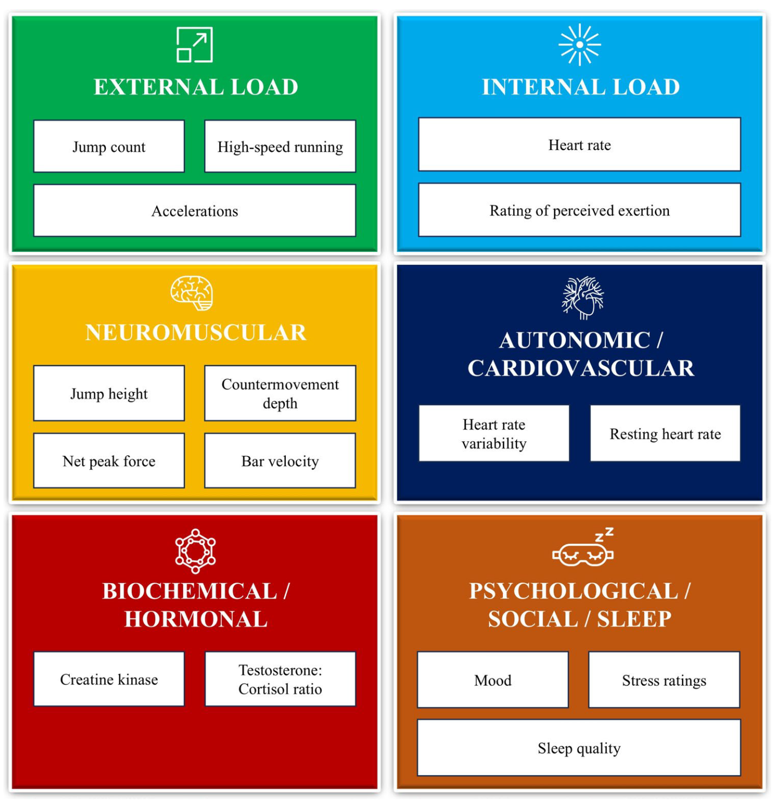
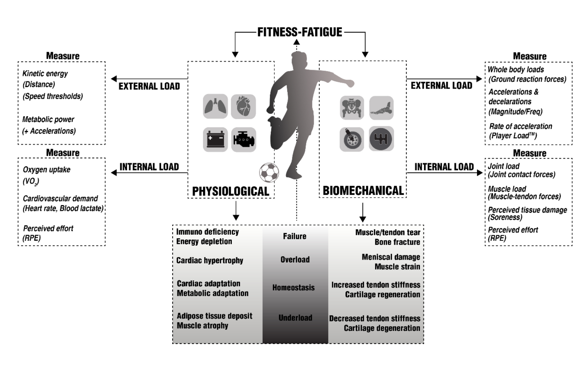

# Monitoring

In this chapter, we introduce training monitoring. I will describe what it is, then give an overview of goals and overall principles before diving into specific methods used to monitor training.

Remember from @sec-trainingprocess (once I write it down 😋) that monitoring is one of the two established strategies to handle the complexity of biological adaptations to training. Primarily, it is the observation of load and response throughout training. The overarching goal is to adhere to the fundamental **training principles**[^8-monitoring-1], avoid unwanted adaptations, minimize injury risk, and predict peak performance. Good monitoring facilitates dynamic adaptations of training and recovery.

[^8-monitoring-1]: I use the training principles as "fundamental" practical guidelines that serve as heuristics during a training process. The training principles will be revised in @sec-trainingprocess (once it is out) but can be found in nearly every textbook on training science e.g. [@ferrautiTrainingswissenschaftFuerSportpraxis2020, p 39].

::: callout-note
## Student's instruction

If you are enrolled in the course, you have to document your own training process over the course of the semester. Use the information in this chapter to monitor your training, keep records, and evaluate them later. At the end, you will create a follow-up training plan based on your observations.
:::

## Why Monitor Training

Monitoring is the continuous observation and evaluation of the training. It assists the SpoSci and the athletes during flexible decision-making throughout the process without dedicated testing or assessment. Typically, we estimate **external** and **internal loads** and **adaptations** and compare them to the **plan** and the **goal**.

**Auto-regulation** refers to very acute adjustments in load or training content based on performance or psycho-physiological states [@greigAutoregulationResistanceTraining2020]. For example, an athlete may measure their isometric grip strength daily to evaluate adaptations and fatigue. Typically, their maximal force is 600 N with a standard deviation (SD) of 30 N. Whenever their grip strength drops under a certain cut-off (e.g., $2 \times SD$), they consider reducing the training volume for the day by 20%, omitting the most taxing exercise. Another example of auto-regulation is adjusting the weight used during resistance exercises based on barbell velocity, or opting for a recovery day when there is a meaningful reduction in morning HRV.

Overall, there is good scientific evidence that auto-regulation may be more effective than fixed periodization for strength development [@zhangAutoRegulationMethodVs2021] and endurance training. A recent study also showed (surprisingly consistent) benefits for different physical attributes of speed skaters [@diAutoregulatedMacromicrocycleTraining2025]. It is not clear which monitoring tools or parameters are most effective. Probably a combination of different objective and subjective metrics should be considered. A 2022 study of 20 amateur rugby players found greater improvements when implementing objective (velocity-based) auto-regulation than when using subjective (RPE-based) autoregulation for strength and power [@shattockAutoregulationResistanceTraining2022]. However, this result may be very specific. <!--# add another recent study comparison here. --> Depending on the outcome of interest, some markers may be better than others. From a practical perspective, the choice is also always a question of resources and the athlete's adherence.

We should also remember that, in scientific studies, researchers typically aim to standardize the training process as much as possible to obtain a robust estimate of population-based results. In the context of auto-regulation, this means that changes to the training are often fixed to pre-specified deviations of the observed variables. However, in practical settings, the monitoring variable is just a tool to start a conversation. Over time, athletes and SpoScis figure out individual solutions and adjust autonomy.

::: callout-note
## Auto-regulation

Auto-regulation should be viewed as the flexible adjustment of training, based on individual needs. Specific solutions are established over time between the athlete and the SpoSci!
:::

## Testing vs Monitoring

Instead of conducting dedicated tests, monitoring allows you to document the athlete's performance or physiological response directly from training. Compared to explicit testing sessions, this has some pros and cons:

**Explicit testing** allows for a well-standardized procedure to establish valid and reliable data. In applied settings, tests often provide further insights into physiology or help differentiate constructs of performance. Think of laboratory tests like CPET or an isokinetic dynamometer to get precise values that you can not conduct easily on the field. They may be costly and time-intensive, need well-trained testers and preparation. Followingly, athletes (and coaches) might enter an explicit testing situation with quite a different mindset. The performance during a test might more closely reflect competition than training data. Explicit testing can also backfire if athletes or coaches manipulate the test to obtain lower test results. For example, at the beginning of the season, athletes may hold back a little, or the coach may hold them back or downplay the significance of the test. This makes sense if they want to present higher rates of improvement. It could also be due to low buy-in, which brings us back to your role as an effective communicator. **Monitoring** and **invisible testing**, on the other hand, can give more realistic (i.e., typical training-related) estimations of performance and adaptation. However, they may suffer from lower standardization, so the data is generally messier. For more information on testing, see the upcoming chapter.

## Multidimensional Monitoring

Monitoring goes beyond tracking load parameters. The big advantage comes from monitoring markers of readiness, fatigue, health, behavior, mental processes, physiological adaptations, and performance. There are hundreds of potential markers for each of the mentioned constructs. None of them is a perfect representation, but should be viewed as practical solutions to quantify the latent structure (i.e., operationalization). In practice, at least one metric should be selected for each of the constructs of interest. No monitoring is perfect, so as a SpoSci, your job is to figure out which monitoring tools are most useful for your athlete and the goal, which provide scientifically rigorous data, while being easy to apply and do not put too much physiological or psychological burden on the athlete (or the analyst).

::: callout-note
## How to decide on monitoring metrics

**Goal orientation criteria**

-   What is your goal during this training phase?

-   Which underlying construct do you have to manage? <!--# (see box XXX)-->

**Athlete criteria**

-   Is it meaningful to the athlete? (If not, is there missing information or misalignment of goals?)

-   What does the athlete understand?

-   What can you expect of the athlete - Do they have the resources and by-in?

-   Can you make it simpler and easier for the athlete?

**Scientific criteria**

-   Is the data reliable and valid enough?

-   Does the metric correlate with something you are interested in?

-   Is there an established change score or cut-off that can be deemed important?

**Practical SpoSci criteria**

Do you have the resources (money, time, staff) to...

-   ... set up the system?

-   ... regularly check the data quality?

-   ... curate the data?

-   ... store the data for long-term use?

-   ... adjust the training according to incoming data?
:::

<!--# figure or list of the different constructs I want to track; List of all the-->

# Decisions based on Monitoring

## Conversation starter

The most important application of regular monitoring is to start a conversation with the athlete. Currently, there is no monitoring tool that is specific and accurate enough to make decisions solely based on it. Meaningful changes in monitoring metrics can be expected or unexpected relative to your plan. For example, a reduction in HRV during a short period of high-volume endurance training might be expected and related to functional overreaching. Changes can also be interpreted as positive or negative. If the autonomic regulation reflected in HRV is related to ongoing training adaptations, it is a good sign. However, if it reflects an infection or lack of sleep, it does not. Disentangling the expectations and evaluations can only be done effectively in correspondence with the athlete. Even with extended monitoring, you never see the full picture without talking to the athlete. At the same time, your job as the SpoSci is to **align your interpretation with the athletes'**. The athlete may interpret the reduction of HRV as inherently bad, which could reduce their trust in their own embodiment (see @sec-interoception), and the training, or even induce nocebo-type effects.

::: callout-note
## Conversation

Talk to the athlete. Why do they think the metric is what it is? Did something unexpected happen? Did they change something in their schedule, training, recovery, or other areas of their life? Does the metric reflect their embodied sensations?
:::

## Flexible Adjustments

While the training plan and periodization are the strategies to manage adaptations and fatigue beforehand, with monitoring, we can make short-term adjustments to the plan. This always happens after the *essential conversation*. It is not always necessary to make changes when facing unexpected changes in monitoring variables. Remember that predictions made (for example, that low recovery scores are related to a higher risk of injury) are probabilistic by nature. Every prediction has a chance of error (Type I, false positive, or Type II, false negative). At best, this should already be presented by a statistical parameter <!--# is this a parameter? --> for certainty <!--#(see later)-->. However, at that stage, you should still reflect if you are willing to make a Type I error. Let's imagine an athlete during the general preparation phase (the next event is a few months out) showing signs of reduced readiness to train. The score is beyond the established practically important difference, and after talking to the athlete you are both convinced that the combined stress of training and personal events is taking a toll. However, she is willing to push through if needed. You are concerned that the readiness score reflects reduced allostatic capacity and that the training would not lead to the intended physical adaptations. In this case, a false positive would mean that the score shows reduced readiness, but the athlete is still able to adapt to the training (even if she feels lousy). Going against the readiness score and continuing training as planned may be the right decision in this situation. However, as a competition approaches, you may not want to risk maladaptations or injuries; trust the metric and adjust the training accordingly.

::: callout-note
The predictions of monitoring metrics are always probabilistic. You adjust the width certainty according to your willingness to make Type I or Type II errors. The absolute error rates are unknown. So even after statistical adjustments and deciding on your statistical parameters of certainty and meaningfulness it is good practice to decide what to do, case-by-case.

**Type 1 error** The metric shows something of importance, like a positive or negative change in performance. However, this is a *false positive* and does not mean anything for the underlying latent construct or prediction made. Examples: The flight time during the jump-test is higher, but this does not reflect improvements during the game. Creatine-kinase goes up 24h after the session, which could signal unusually high tissue damage. However the athlete hit is shin in the locker room which does not impair his ability to train but adds to his typical CK changes.

**Type 2 error** In this case the metric does not catch real changes that are happening and does not predict outcomes in the intended way. This is a *false negative*. Examples: You measure jump-height via flight time on a contact mat. The value stays within the typical error range over weeks, however during practice the athlete is able to jump higher to catch a ball because the standardized CMJ monitoring after warm-up does not transfer well enough to the actual jump during the sport
:::

## Improving internal feedback {#sec-interoception}

Monitoring is not just a way to gather data for the SpoSci, but is also an additional way to give feedback to the athlete. They can compare their internal feedback of the body with the measurements and improve their understanding of their psychophysiological state. By doing so, we can help athletes increase their awareness and self-efficacy, becoming more mature and autonomous. Thereby, they enhance their ability to train and perform at their highest level without sacrificing their health.

Interoception is the processing of internal sensations coming from the body and is essential for predicting and regulating our psychophysiological state [@craigInteroceptionSensePhysiological2003, @theriaultItsNotThought2025]. In the context of sports and exercise, a correct understanding (not necessarily conscious) is essential for performance and recovery. For example, competing theories have been proposed to describe the limitation of endurance capacity from a central (i.e., brain-centered) versus peripheral (i.e., heart- and muscle-centered) perspective [@noakesCentralGovernorModel2007; @marcoraWeReallyNeed2008]. Building on this research, we now establish a more integrative perspective of the regulation of endurance [@stclairgibsonInteractionPsychologicalPhysiological2017; @perez-diazTaskFailureEndurance2026]. A well-developed interoception is essential for optimal management of the body's resources and can be learned and trained! For more information, I highly recommend reading a recent pre-print on this topic by @scottwelshInteroceptiveIntelligenceSports2026.

## Classification Framework for Monitoring Variables

To gain a comprehensive understanding of training, we should select monitoring variables from different aspects of the athlete-environment interaction. Rebelo et al. [-@rebeloMonitoringTrainingEffects2026] give us 4 domains of monitoring variables, presented in @fig-monitoring_domains.

{#fig-monitoring_domains .illustration width="594"}

### External and Internal Load

Vanrenterghem et al. [-@vanrenterghemTrainingLoadMonitoring2017] presented a framework that differentiated between **biomechanical and physiological load**, both from external and internal perspectives (@fig-loadmonitoring). Biomechanical and physiological load should be considered separately to represent distinct pathways or subsystems of adaptation. Basically, the argument is similar to that of Chiu and Barens [-@chiuFitnessFatigueModelRevisited2003], who presented different modeling curves of fitness and fatigue. They argue that adaptations are based on internal loading, which is sometimes harder to estimate. Their paper focuses on team sports. But the idea can be applied to other training paradigms [@vanrenterghemTrainingLoadMonitoring2017].

{#fig-loadmonitoring .illustration}

In general, biomechanical external loads are relatively easy to measure directly. In the context of strength and conditioning, external biomechanical loads are parameters that define and structure training plans for strength and power-based applications. Internal biomechanical loads are much more difficult to capture. They can hardly be measured directly but must be estimated based on external loads and biomechanical models.

Subjective measures of perceived tissue load (or sometimes imprecisely referred to as "tissue damage") can be a simple proxy of biomechanical internal load. Specifically, @vanrenterghemTrainingLoadMonitoring2017 use soreness as a proxy for tissue damage. **Soreness** (i.e., delayed onset muscle soreness; DOMS) should be a leading indicator for regulating training, as it reduces maximal torque production, reduces range of motion, and coordination [@cheungDelayedOnsetMuscle2003]. DOMS are probably related to connective tissue and sarcolemmal damage [@wilkeDelayedOnsetMuscle2021]. Some recent studies also examined axonal compression around intrafusal fibers [@sonkodiHaveWeLooked2020]. Nevertheless, resulting enzymatic efflux and pro-inflammatory processes might influence the perceived pain. But this does not guarantee a direct relation with load. For example, concentric contractions do not result in the same amount of DOMS. Also, new exercise routines and novel stimuli lead to disproportionately high DOMS at lower external force production. The relation between DOMS and molecular markers of muscle damage is also weak at best [@nosakaDelayedonsetMuscleSoreness2002; @wilkeDelayedOnsetMuscle2021]. Lastly, Soreness is not necessarily a direct result of the damage but must be related to neural signaling and sensitivity. Tissue with minimal neural innervation (such as joint cartilage) may withstand heavy mechanical loads, but does not indicate subjective soreness.

The **subjective perception of effort**, for example, on a scale from 1 to 10 (RPE), can also serve as a marker of internal biomechanical load.

\*\***More is coming soon**\*\*

<!--# On the physiological side, the external load can be described as the kinetic energy (distance or metabolic power exerted outward). The internal physiological load could be oxygen uptake, cardiovascular demand (represented by heart rate), or blood lactate levels. If we look at the simplified model in which we train our basic conditioning abilities, we find that in endurance training, the internal physiological load is much easier to monitor. A lot has happened here: almost everyone now owns a sports watch or a smartphone that can measure steps and speed via GPS or accelerometers. However, heart rate and lactate levels remain classic methods for internal physiological load. Even before the revolution of smartwatches (Garmin, Polar, etc.), endurance training was primarily controlled via these internal metabolic loads. On another level, according to this concept, we not only look at fatigue and load but also at homeostasis or underload. We essentially have a continuum of load that we can track physiologically and biomechanically. On the biomechanical side, an underload would mean, for example, a decreased stiffness of tendons, ligaments, connective tissue, cartilage, or bones. An overload or fatigue would potentially lead to injuries of this tissue. On the physiological level, it is slightly more complicated, but basically, we are talking about a similar inverted U-shape. We have the underload (which leads to muscle atrophy, for example) all the way to overload and fatigue (with immunodeficiencies, energy depletion, RED-S, etc.) and on the other side, adaptations like cardiac hypertrophy. [Slide 13, 14 & 15] Okay, we are now moving from the broad concept of monitoring to a practical example. On slide 13, a questionnaire is shown. I want us to think together about what stands out to us in this representation. We have a questionnaire with five so-called items, and each of these items has a scale with five values from 1 to 5. Now the question is: What does each individual scale value mean? For this, there are so-called anchors – in this case for the maximum and minimum values. You might have noticed this in other questionnaires – think of the classic Borg scale with anchors for each individual value, or just for extreme values. One problem, of course, is: What do these anchors mean for the respective person individually? Another important aspect is the linguistic representation. We see here, for example, that the anchors are bilingual: in German “schlecht geschlafen” and in English “restless”, or “sehr gut geschlafen” and “very restful”. Is that a good translation? You could say yes. Perhaps it is a bad translation, and the terms mean slightly different things to people of different native languages. Here it is relatively obvious: “schlecht geschlafen” (slept poorly) and “restless” can be interpreted quite differently. In other cases, this shift in meaning is much more subtle. Another problem on this slide: For the first item, the spacing (the visual distance) between the values is larger than for the second or fifth question. From a Gestalt psychology perspective, this physical space between the points means something to us as humans. When the distances vary, the perceived distance between the values also changes for us psychologically. This can lead to distortions. As long as the spacing within a scale is equal and remains constant over time, it is probably okay for practice. But if we use a Google Form, for example, different end devices can lead to different spacings. An athlete might fill out the form once on their phone and once on their laptop. It would be even worse if the layout broke in such a way that values 1 to 3 were on one line and 4 and 5 slipped to the next. Or if the distance between 1 and 2 is visually smaller than between 2 and 3. Our brain immediately interprets this to mean that 1 and 2 are also closer to each other in terms of their content. For item 3, it is shown that we could also reverse the extreme values. Instead of “1 = very stressed” and “5 = little stressed”, we could flip it. That also makes a difference. An advantage of switching the polarity is that people have to briefly think actively about which direction to check. If all questions are polarized in the same direction, it tempts people to fill them out very thoughtlessly. We see other display options here as well, such as with stars or a vertical layout. What we can conclude: Different forms of presentation trigger different reactions in us, and we must be aware of this. This directly addresses the issue of reliability. What we are still missing here is the topic of validity. We can generate very reliable, i.e., reproducible results with questionnaires, but if the measured values have nothing to do with actual reality, it is still not useful. [Slide 16] Okay, for training monitoring we have various parameters. We distinguish between load parameters of the stimulus and load parameters of recovery. The stimulus parameters can be divided into external and internal load as well as the volume of the stimulus. With external load, we are talking, for example, about the absolute weight in kilograms, the relative load in percent of 1RM, speeds, or pure physical power. The internal load is described here as intensiveness. This includes session RPE as a subjective load parameter, the RPE of a single exercise, “Reps in Reserve” (RIR), or more endurance-oriented parameters like heart rate, lactate, and oxygen uptake. Volume describes the number of repetitions, sets, duration, distance, or work performed. The parameters of recovery include density (rest periods) and the frequency of training. A training session is only fully documented and planned if one measurement parameter is tracked for each of these categories. Only then can we make statements about the effectiveness of the training and its effects over a longer process. An example: If we monitor the stimuli but not the recovery (rest duration) in between, this might not seem to carry much weight at first glance during interval training. Interestingly, studies on improving VO2max often show that over a few weeks, it produces relatively similar results whether you do one-minute hard intervals with a 4-minute break or a 30-minute break. But both are legitimate strategic approaches. I can increase the density to train the ability to repeatedly perform under fatigue, or I can decrease the density to keep the absolute power output in each individual bout (stimulus) as high as possible. Only if I really track all parameters will I know later why athlete X achieved an improvement in test performance Y. [Slide 17] In addition to pure training parameters, there is athlete-oriented monitoring. Here I am referring to readiness, fatigue, recovery, psyche, and other physiological parameters. But I want to emphasize that the individual markers are not exactly distinct and do not always reflect just a single concept. Training readiness, for example, could be measured subjectively via a readiness score. However, we can also use performance-oriented markers and test the Isometric Mid-Thigh Pull (IMTP), grip strength, Rate of Force Development, jump height, or reaction times before training. We can also measure fatigue from training or from general life stress. Examples include heart rate variability, resting heart rate, cortisol, or the T/C ratio (testosterone-to-cortisol ratio). Similarly, there are markers like creatine kinase, myoglobin, or sAA (salivary alpha-amylase, an enzyme in saliva associated with the sympathetic response). Each of these parameters often has little predictive value on its own, but taken together they form an important tool for understanding fatigue. We can also track recovery itself. Cortisol or creatine kinase are more likely markers where an increase is interpreted negatively. On the other hand, if we look at sleep behavior or the recovery of heart rate variability, we are also observing resources. This is something we shouldn't forget from a psychological perspective when communicating with athletes. I have listed psychological factors separately here again. We can monitor major psychological states: emotions, general mood (e.g., POMS), stress, motivation, or Fear Avoidance Beliefs (FABQ). In the past, it has turned out that these subjective parameters are at least as important as the physiological markers. Why is that? An accepted theory states that these psychological sensations represent a kind of summary by the “Bayesian Brain” regarding the overall regulation of the body. Someone who has good interoception gets an excellent heuristic about their overall physical condition via emotions, stress levels, and motivation. Of course, physiological factors like symptoms of illness, the menstrual cycle, nutrition, hydration, or body temperature also play into the psyche. This is a very extensive list of various possibilities. Unlike with training parameters, you don't necessarily have to cover one point from each category here. However, it is definitely advantageous to track one or two parameters on different levels. Especially physiological parameters (illness symptoms, menstrual cycle) can be used excellently situationally. You don't have to log every day that you are perfectly healthy, but only record when special situations occur – like when you have a cold or a headache. [Slide 18] Historically, attempts have often been made to use one of these parameters as the ultimate monitoring tool. For a while, the T/C ratio was the thing, before that it was lactate, sometimes CK or urea. Today there are new trends through continuous measurement methods: blood glucose levels, ketones, and potentially continuous blood lactate monitoring in the near future. It is a constant evolution. But in general, it has been shown that individual predictors alone are rarely successful. In the future, there will likely be a growing reliance on the combination of many parameters – especially fueled by the rapid development of machine learning and AI. The hope is that we can recognize patterns from large datasets that we as humans cannot easily see. In this course, however, we focus on currently applicable methods. In such a fast-paced field, this has the disadvantage that our educational content sometimes lags slightly behind technological developments. An important final conclusion: It is not so crucial to learn exactly what the “best” parameter is right now and how it works 100%. It is much more important to understand that there are always new trends, that parameters must be combined, and that a purely data-driven perspective will never provide 100% answers to what an athlete can tell us or what ultimately shows in a competition. That is the reality and the complexity of the training process, which we can never map seamlessly – but which also makes the whole thing exciting and human.  -->

# References
