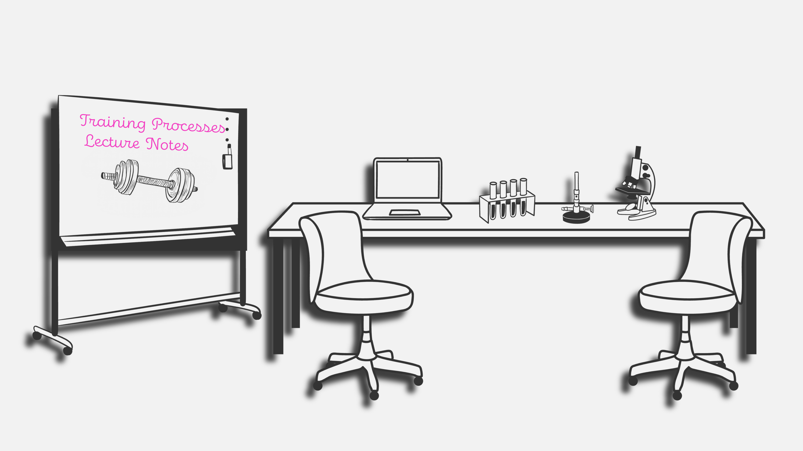

# Training Processes - Lecture Notes

```{r, include = FALSE, message= FALSE}
library(tidyr)
library(dplyr)
library(readxl)
library(knitr)
library(kableExtra)

#current document version displayed
ls_metadata = list(last_update = as.Date("2026-03-17"),
                   current_version = "b0.0.1",
                   author_name = "Peter Raidl",
                   author_email = "peter.raidl@univie.ac.at",
                   author_orcid = "0000-0002-1850-734X")
save(ls_metadata,
        file = "metadata.rds")
```

*Version `r ls_metadata$current_version`*

Last update `r ls_metadata$last_update`

{#fig-cover width="400"}

This text serves as lecture notes for students enrolled in the **Training Processes** course at the University of Vienna and is provided as an openly accessible resource. The current version should be considered a **beta version**, and I hope for further revisions during and after the current semester. I welcome suggestions, complaints, and requests from students and interested readers.

If you are a student in my seminar, please be aware that I do not guarantee that all information presented during the lecture is currently part of this script! This is a work in progress! Please treat it as an additional source of information. I will do my best to improve the text's quality and add additional chapters whenever possible.

The seminar on Training Processes is part of the Bachelor's degree in Sports and Movement Sciences. (Curriculum [2017](https://lehre-schmelz.univie.ac.at/fileadmin/user_upload/p_studienangebote_schmelz/Studium/Studienangebote/Studienrichtung/29.03.2017_Curriculum_Sportwissenschaft.pdf) and [2024](https://lehre-schmelz.univie.ac.at/fileadmin/user_upload/p_studienangebote_schmelz/Studium/Studienangebote/Studienrichtung/2024_2025_146.pdf)) at the [University of Vienna](https://www.univie.ac.at/).

Constructive feedback is gladly accepted via [email](peter.raidl@univie.ac.at) or on [GitHub](https://github.com/Paeddasan/Training-Processes-Lecture-Notes/discussions).

Thank you,

Peter Raidl [](https://orcid.org/0000-0002-1850-734X)
